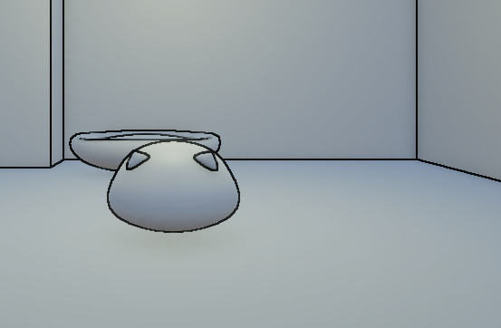

# Unity URP Outline Post-Process Shader

A neat little post-process shader for URP that slaps some outlines on your scene. Basically grabs depth and normal info to figure out where edges are, then draws lines around 'em.



## What's this thing do?

So like, the shader peeks at your scene's depth buffer and normals to spot where stuff overlaps or angles change. Then it goes ahead and throws an outline on those edges. Uses Sobel edge detection for smooth, clean edge detection with anti-aliasing.

## Getting it working

1. Chuck the shader file anywhere in your Assets folder
2. Set up a custom renderer feature:
   - Make a new C# script for the renderer feature thingy
   - Hook up this shader material
   - Toss that feature into your URP Renderer asset
3. Tweak these knobs till it looks good:
   - **Outline Color**: What color you want (alpha controls how strong it blends)
   - **Depth Threshold**: How picky it is about depth differences (scales with distance, lower = catches more edges)
   - **Normal Threshold**: How picky about surface angles (lower = more sensitive)
   - **Outline Thickness**: How thicc you want those lines (affects sampling radius)

## Example setup

```csharp
// these values usually slap:
_OutlineColor = new Color(0, 0, 0, 1);
_DepthThreshold = 1.5f;
_NormalThreshold = 0.1f;
_OutlineThickness = 0.6f;
```


## What you need

- Unity with URP (duh)
- Depth and Normal textures turned on in your URP Renderer settings

That's pretty much it! Your scene should start showing outlines around stuff right away.
